# GSPC Interoperability and Growth Blueprint

**Date:** 2026-09-04  
**Status:** Architecture proposal; not a deployment record  
**Scope:** Council OS, GSPC, and the Request Attestation Service (RAS)  
**Source rule:** External claims below use official primary sources only. Repository observations are explicitly labelled and are not proof of a live deployment.

**Execution authority:**
`docs/blueprints/MASTER_CONSOLIDATION_AND_EXECUTION_2026-09-04.md`. This is the
technical interoperability supplement, not a second product or lifecycle
authority.

## 1. Executive decision

The defensible goal is not “run every model” or “certify everything.” It is:

> Make Council OS the neutral evidence and interoperability layer through which any authorised person, organisation, agent, model, legacy system, or regulated workflow can request a scoped measurement; obtain reproducible evidence; receive a signed, independently verifiable record; and carry that record across the tools they already use.

That gives the product one centre of gravity:

**One Attestation Request, one event ledger, one evidence grammar, many adapters.**

MCP, A2A, OpenAI, Anthropic, Hugging Face, browser extensions, x402, SCITT, Sigstore, OpenTimestamps, XRPL, Ethereum, SWIFT-facing workflows, and COBOL are not separate products or separate sources of truth. They are ingress, evidence, payment, presentation, or witness rails around the same RAS lifecycle.

The non-negotiable semantic boundary is:

- Council measures and attests to a disclosed observation under a named instrument, version, sample, and time.
- A signature establishes issuer and integrity, not truth, safety, legality, or regulatory approval.
- A transparency receipt or timestamp establishes registration/inclusion/time evidence, not truth.
- A ledger observation establishes only the state actually observed at a pinned ledger or block.
- A paid request purchases work or evidence production, never a higher result.
- A regulator, court, scheme owner, qualified assessor, enterprise risk owner, or other accountable human makes any legal, certification, approval, or deployment determination.

This blueprint therefore uses **measurement credential**, **signed card**, **receipt**, and **evidence**. It does not use “certified,” “approved,” or “compliant” as product outcomes.

## 2. Claim and status grammar

Every material statement in implementation documentation and user interfaces should carry one of these meanings:

- **[STANDARD FACT]** — behaviour defined by the cited external standard or official product documentation.
- **[LOCAL FACT]** — behaviour found in this repository. It does not prove that the same behaviour is deployed.
- **[LOCAL POLICY]** — a Council quality or governance rule, not an external standard.
- **[PROPOSAL]** — a target design in this blueprint.
- **[RUNTIME UNKNOWN]** — code or artefacts exist, but current service, key, anchor, inclusion, or external account state was not independently probed.

Gap-matrix statuses have deliberately narrow meanings:

| Status | Meaning |
|---|---|
| `EXISTS` | The named repository capability or artefact was inspected and is materially present. It says nothing about live runtime state unless the row explicitly says so. |
| `NEEDS_VERIFY` | Something is present or claimed, but protocol conformance, runtime state, key identity, freshness, or external inclusion still needs a bounded probe. |
| `MISSING` | The required canonical capability was not found. |
| `DUPLICATE` | More than one implementation, manifest, count, or narrative competes to describe the same surface. |
| `RETIRE` | The item should no longer be used as a production or public source of truth. Preserve history where needed; do not silently delete evidence. |

## 3. The rail model

```mermaid
flowchart LR
  subgraph Ingress[Ingress and orchestration]
    Web[Council OS]
    Ext[Browser or desktop extension]
    MCP[MCP]
    A2A[A2A]
    Vendors[OpenAI and Anthropic]
    HF[Hugging Face Space]
  end

  subgraph Core[Authoritative control plane]
    RAS[RAS API]
    Ledger[Append-only request event ledger]
    Policy[Consent, approval, and policy gates]
    Queue[Executor queue]
    Admission[Reproduction and admission]
    Signer[Isolated signer]
    Root[Root and proof service]
  end

  subgraph Evidence[Evidence-source adapters]
    Models[Model and dataset executors]
    Regs[Official regulatory sources]
    Legacy[COBOL and enterprise systems]
    Finance[XRPL, EVM, token and messaging observations]
  end

  subgraph Witness[Optional witness and publication rails]
    SCITT[SCITT transparency service]
    Sigstore[Sigstore bundle and log]
    OTS[OpenTimestamps]
    Index[Public card and dataset index]
  end

  Ingress --> RAS
  RAS --> Ledger
  Ledger --> Policy
  Policy --> Queue
  Queue --> Evidence
  Evidence --> Admission
  Admission --> Signer
  Signer --> Root
  Root --> Witness
  Ledger --> Ingress
```



**[PROPOSAL]** Only the RAS command service may request lifecycle transitions. Adapters submit commands or evidence and consume events. They must not write measurement state, sign cards, or publish roots directly.

### 3.1 Rail responsibilities

| Rail | What it may do | What it must never imply |
|---|---|---|
| REST, MCP, A2A | Create/read/cancel a request; attach evidence; request or record an explicit approval | That a transport created a valid measurement |
| AG-UI, A2UI, Space, extension | Project state and collect authorised input | That UI state is authoritative |
| Model/Hugging Face executor | Run a frozen plan and return content-addressed outputs | That compute-provider output is admitted or signed |
| Regulatory adapter | Capture an official source snapshot and normalized citation | That a mapping is legal advice or a compliance decision |
| XRPL/EVM/SWIFT/COBOL adapter | Return a pinned, typed observation plus provenance | That an observation establishes ownership, settlement finality, KYC, or legality beyond its scope |
| x402 | Challenge, verify, and settle payment for a priced operation | That payment changes grade, admission, or legal status |
| Admission service | Reproduce and decide whether evidence satisfies a disclosed Council measurement policy | That admission is external certification |
| Signer | Sign only an admitted canonical payload | That a signature proves the payload is true |
| SCITT, Sigstore, OTS, chain pointer | Add independently checkable inclusion, identity, or time evidence | That a witness endorses the measured subject |

### 3.2 Axes, sectors, parties, and “benchmark the benchmarkers”

**[PROPOSAL]** Make the axis registry versioned data, not a protocol constant. If the current GSPC release contains 22 axes, `22` is a dated inventory fact—not a value that belongs in badges, manifests, or client logic. Every axis record needs a stable ID, version, definition, applicability predicate, instrument references, input/evidence schema, output schema, uncertainty/error rules, reviewer qualifications, and supersession history.

Sector packs sit above that registry. A pack maps a jurisdiction, industry, lifecycle, and source snapshot to applicable axes and evidence requirements; it must not redefine an axis invisibly. Party overlays then describe who may submit, observe, approve, challenge, remediate, or decide: public complainant, subject owner, model provider, deployer, enterprise risk owner, auditor/assessor, regulator, insurer, bank, issuer, transfer agent, custodian, registry, or infrastructure operator. The RAS request binds the selected pack/axis/party versions, so one engine can serve every applicable combination without pretending every axis applies to every subject.

Benchmarks, datasets, evaluators, providers, regulatory packs, and Council instruments are themselves valid RAS subjects. A “benchmark the benchmarkers” instrument should measure provenance, construct validity, population/sampling, contamination, statistical power, scoring and aggregation, missing/error semantics, robustness, accessibility, reproducibility, conflicts, maintenance, and version drift. It produces a scoped measurement of the benchmark; it does not declare the benchmark universally valid or endorsed.

## 4. Canonical RAS contract

### 4.1 One request, orthogonal states

A single linear status is not enough. Payment can fail while evidence remains valid; a card can be signed while an optional Bitcoin timestamp remains pending; an approval can be required without changing measurement semantics. The canonical object therefore carries orthogonal state machines.

**[PROPOSAL] Request/workflow lifecycle**

```text
DRAFT -> SUBMITTED -> TRIAGED -> SCOPE_PROPOSED -> AUTH_REQUIRED
      -> SCOPE_LOCKED -> QUEUED -> RUNNING -> EXECUTION_COMPLETED
      -> REPRODUCTION_PENDING -> ADMISSION_PENDING -> DELIVERY_READY
      -> DELIVERED -> MONITORED
```

Allowed terminal or exceptional outcomes are typed rather than coerced into a score:

```text
UNMEASURED | UNCHECKABLE | UNREACHABLE | REJECTED | CANCELLED
EXPIRED | FAILED | SUPERSEDED | REVOKED
```

**[PROPOSAL] Orthogonal substates**

| Dimension | States |
|---|---|
| Measurement | `NOT_STARTED`, `RUNNING`, `CANDIDATE`, `REPRODUCED`, `MEASURED`, `UNMEASURED`, `UNCHECKABLE`, `STALE`, `SUPERSEDED`, `REVOKED` |
| Credential | `NONE`, `PENDING_ADMISSION`, `ADMITTED`, `SIGNED`, `SIGNATURE_INVALID` |
| Root | `NOT_INCLUDED`, `INCLUDED`, `PROOF_AVAILABLE` |
| Witness | `NOT_REQUESTED`, `PENDING`, `WITNESSED`, `FAILED`, `EXPIRED` |
| Payment | `NOT_REQUIRED`, `REQUIRED`, `VERIFIED`, `SETTLED`, `FAILED`, `REFUNDED` |
| Approval | `NOT_REQUIRED`, `REQUIRED`, `AWAITING_INPUT`, `APPROVED`, `DENIED`, `EXPIRED` |

No payment, UI, transport, or witness transition may promote `measurement_state` or `credential_state`.

### 4.2 Required request fields

**[PROPOSAL]** The authoritative RAS object should minimally bind:

| Group | Required data |
|---|---|
| Identity | `request_id`, tenant, requester identity, actor type, created time, current revision |
| Authority | purpose, consent basis, requested action, permitted disclosures, data classification, retention/delete policy, jurisdiction |
| Subject | subject type, canonical locator, immutable revision/digest, model/provider/API version where applicable, parent/base/adaptor/quantization lineage |
| Measurement | requested instruments and pack versions, axes/scope, as-of time, sampling plan, seeds, thresholds, exclusions, expected failure semantics |
| Execution | executor class, image/environment digest, dependency lock digest, provider/region, hardware class, start/end time, job manifest digest |
| Evidence | source plan, source terms/licence, immutable raw object digests, normalized object digests, retrieval metadata, chain of custody |
| Human loop | required roles, approval checkpoints, conflicts, decisions, reasons, timestamps |
| Economics | quoted price, x402 network/scheme/asset, payment receipt reference, refund state; kept outside grade fields |
| Results | per-cell observations, sample counts, confidence/uncertainty, errors/timeouts, raw-output digests, reproduction comparison |
| Credential | admission decision and policy digest, canonical payload digest, signer key identifier, signature, signed time |
| Inclusion | root identifier, leaf index, inclusion proof, previous root, correction/supersession link |
| Witness | witness type, submitted digest, receipt/bundle/proof digest, identity policy, status and checked time |

Store large or sensitive evidence by content-addressed reference, not inline. The request record should bind the digest, media type, size, access policy, and retention status.

### 4.3 Event grammar

Every state mutation emits one append-only event:

```json
{
  "event_id": "evt_...",
  "request_id": "ras_...",
  "revision": 12,
  "event_type": "evidence.captured",
  "occurred_at": "2026-09-04T00:00:00Z",
  "actor": {"type": "service", "id": "regulation-adapter"},
  "command_id": "cmd_...",
  "prior_event_digest": "sha256:...",
  "payload_digest": "sha256:...",
  "payload": {}
}
```

**[PROPOSAL]** Use optimistic revision checks, an `Idempotency-Key` on mutating commands, cursor-resumable events, and an outbox for adapter delivery. Retries with the same key return the same command result. No adapter may depend on at-most-once delivery.

### 4.4 The measurement ceremony

MCP is a transport, not a ceremony. The shared ceremony is:

1. Accept the request, authority, subject fingerprint, and disclosure boundary.
2. Resolve and freeze the instrument, pack, evidence plan, sample, and environment.
3. Obtain any required payment and human approval as separate gates.
4. Capture evidence with source, time, version, digest, and chain-of-custody metadata.
5. Execute the frozen plan; retain errors, refusals, timeouts, and missing cells as typed observations.
6. Reproduce on the policy-required independent path.
7. Admit or reject under a versioned, disclosed admission policy.
8. Canonicalize and sign the admitted measurement card with an isolated key.
9. Include the card digest in the append-only root and issue an inclusion proof.
10. Optionally obtain SCITT, Sigstore, OTS, or ledger-pointer witnesses, each linked to the same digest.
11. Publish only the permitted card/index fields; retain a correction, supersession, appeal, and revocation route.

### 4.5 Public endpoints that are actually necessary

**[PROPOSAL] Canonical public API**

| Method and path | Purpose |
|---|---|
| `POST /v1/attestation-requests` | Create an idempotent request; may return an x402 challenge before acceptance |
| `GET /v1/attestation-requests/{request_id}` | Read the authorised projection and all orthogonal states |
| `POST /v1/attestation-requests/{request_id}/evidence` | Attach an inline-small object or a content-addressed/presigned reference |
| `POST /v1/attestation-requests/{request_id}/approvals` | Submit an explicit, role-bound approval or denial; never infer consent from continued use |
| `POST /v1/attestation-requests/{request_id}/cancel` | Request cancellation; preserve already-issued evidence and audit events |
| `GET /v1/attestation-requests/{request_id}/events` | Cursor-resumable SSE or JSON event stream |
| `GET /v1/measurements/{measurement_id}` | Read the disclosed measurement projection |
| `GET /v1/subjects/{subject_id}/measurements` | Enumerate disclosed current and historical measurements without collapsing lineage |
| `GET /v1/cards/{digest}` | Retrieve the exact signed card by digest |
| `POST /v1/verify` | Verify supplied card/root/proof material without requiring publication |
| `GET /v1/roots/{root_id}` | Retrieve a signed root |
| `GET /v1/proofs/{card_digest}` | Retrieve an inclusion proof and correction/supersession state |
| `GET /v1/instruments` | Enumerate versioned public instrument descriptions |
| `GET /v1/packs` | Enumerate versioned mapping-pack metadata and legal-source snapshot dates |
| `GET /v1/capabilities` | Machine-readable transports, versions, auth, limits, data classes, and witness availability |

Production webhook management is also needed, but only after durable storage and delivery security exist:

- `POST /v1/webhook-subscriptions`
- `GET /v1/webhook-subscriptions/{id}`
- `DELETE /v1/webhook-subscriptions/{id}`

Callbacks need an egress allowlist or safe resolution policy, HTTPS, HMAC or asymmetric signatures, event IDs, timestamp/replay windows, exponential retry, a dead-letter record, tenant isolation, and secret rotation. The current demo webhook path must not be promoted by configuration alone.

**[PROPOSAL] Internal-only interfaces**

- executor lease, heartbeat, checkpoint, result, and failure submission;
- reproduction assignment and comparison;
- admission decision with policy digest and reviewer/automaton identity;
- signer request over a canonical digest only;
- root append and proof generation;
- witness submit, upgrade, verify, and status refresh;
- regulatory source ingest, normalize, diff, quarantine, and release.

These interfaces require service identity, narrow audience-bound credentials, tenant scopes, and network policy. They are not public MCP tools.

## 5. Transport and product adapters

### 5.1 MCP

**[STANDARD FACT]** MCP defines `stdio` and Streamable HTTP transports. A Streamable HTTP server uses a single endpoint for POST/GET as applicable, must validate `Origin`, and negotiates the protocol version through `MCP-Protocol-Version`. The authorization specification uses OAuth protected-resource metadata and scoped authorization. See the official [MCP transport specification](https://modelcontextprotocol.io/specification/2025-11-25/basic/transports) and [MCP authorization specification](https://modelcontextprotocol.io/specification/2025-11-25/basic/authorization).

**[PROPOSAL]** Expose the same RAS operations as a deliberately small MCP surface:

| MCP primitive | Canonical mapping |
|---|---|
| `request_attestation` | `POST /v1/attestation-requests` |
| `get_attestation_request` | `GET /v1/attestation-requests/{id}` |
| `provide_evidence` | Evidence command; explicit confirmation for sensitive disclosure |
| `approve_attestation_step` | Approval command; always treated as a consequential action |
| `cancel_attestation_request` | Cancellation command |
| `verify_card` | Pure local/server verification with no mutation |
| resources | Cards, roots, proof material, public instruments, public mapping-pack metadata |

Pin a supported stable MCP version, implement version negotiation, publish exact scopes, and reject unsupported versions explicitly. Release candidates should be exercised in a test lane, not silently treated as stable; the MCP project described its July 2026 work as a [release candidate](https://blog.modelcontextprotocol.io/posts/2026-07-28-release-candidate/).

### 5.2 A2A

**[STANDARD FACT]** The official A2A specification defines Agent Cards, Messages, Tasks, Artifacts, task status, long-running work, human-in-the-loop states, and JSON-RPC, gRPC, and HTTP+JSON bindings. Supported interfaces in an Agent Card must correspond to an actual binding. See the [A2A specification](https://github.com/a2aproject/A2A/blob/main/docs/specification.md).

**[PROPOSAL]** Map A2A without creating a second job ledger:

- A2A Task ID aliases the immutable RAS request ID.
- inbound Message parts become commands or evidence references after authorization;
- Task status is a projection of RAS lifecycle and approval state;
- `input-required` represents a specific human approval/evidence request;
- Artifacts represent frozen plan manifests, evidence bundles, signed cards, roots, and witness receipts;
- correction and supersession remain RAS events surfaced through task history;
- the Agent Card advertises only bindings that pass conformance tests.

An HTTP JSON endpoint that returns an assessment is not thereby an A2A Task server. The repository Agent Card should not advertise such an endpoint as A2A until the task methods, version header, errors, streaming/polling, and artifact semantics exist.

### 5.3 AG-UI and A2UI

**[STANDARD FACT]** AG-UI models an agent run as an observable event stream with lifecycle, text, tool, and state events; state deltas use JSON Patch. See the official [AG-UI architecture](https://docs.ag-ui.com/concepts/architecture) and [event catalogue](https://docs.ag-ui.com/concepts/events).

**[STANDARD FACT]** A2UI is a versioned declarative UI-message format with surface creation, component updates, data-model updates, and surface deletion. It is a presentation protocol, not an authorization or evidence authority. See the [A2UI specification](https://a2ui.org/specification/v0.9-a2ui/).

**[PROPOSAL]** The RAS event ledger drives both:

- AG-UI emits a complete run envelope, including start, content/tool/state events, approval requests, errors, and finish; event IDs and RAS revisions make reconnects deterministic.
- A2UI renders the request form, evidence disclosure boundary, approval prompt, live evidence table, signed card, and correction history.
- The server validates every submitted action against RAS authorization. A rendered button never confers authority.
- Untrusted model output may fill text or proposed fields, but cannot directly issue an approval, alter a digest, or select a hidden instrument.

### 5.4 OpenAI and Anthropic

**[STANDARD FACT]** OpenAI plugins use an MCP server for ChatGPT/Codex integrations and may add an iframe UI. The OpenAI API can invoke a remote MCP server with an allowlisted tool set and configurable approval requirements. Official guidance warns that remote MCP is a sensitive boundary and that approvals matter for consequential tools. See the [OpenAI plugin quickstart](https://developers.openai.com/plugins/build/app-quickstart), [MCP server guide](https://developers.openai.com/plugins/build/mcp-server), and [remote MCP tool guide](https://developers.openai.com/api/docs/guides/tools-connectors-mcp).

**[STANDARD FACT]** Anthropic supports custom remote-MCP connectors, subject to user or organization permissions. See Anthropic's [custom connector guidance](https://support.claude.com/en/articles/11175166-get-started-with-custom-connectors-using-remote-mcp).

**[PROPOSAL]** Maintain one standards-conformant remote MCP server and one optional MCP Apps-compatible UI resource. Vendor manifests should contain discovery/auth metadata only. Do not fork measurement logic by vendor. Mutating or disclosure-bearing tools require explicit approval, narrow scopes, and a human-readable summary of the exact data/action.

No documentation or UI may claim an OpenAI directory listing, Anthropic listing, partnership, or endorsement until that exact external state has been observed and recorded.

### 5.5 Browser and desktop extension

**[PROPOSAL]** The extension should be a thin, privacy-preserving client:

- detect a supported model/dataset/card page;
- calculate or resolve the immutable subject revision;
- verify a supplied card and root locally where possible;
- show integrity, measurement, scope, age, and supersession as separate fields;
- request a new measurement through RAS only after showing price, disclosure, and consent;
- open the canonical evidence page rather than duplicating its narrative.

It must never scrape private model inputs by default, inject a score without a verifiable card, or label a page safe/compliant/certified.

## 6. Hugging Face distribution strategy

### 6.1 What the platform supports

**[STANDARD FACT]** Hugging Face model repositories can use README model cards with structured YAML metadata covering intended uses, limitations, training, and evaluation; dataset repositories have analogous dataset cards for provenance, context, bias, and licence/discovery. See the official [model-card](https://huggingface.co/docs/hub/en/model-cards) and [dataset-card](https://huggingface.co/docs/hub/datasets-cards) documentation.

**[STANDARD FACT]** Spaces are Git-backed application surfaces using supported SDKs such as Gradio, Docker, or static HTML. Jobs provide separate background compute with selectable hardware and programmatic submission. Inference Providers cover provider-supported model mappings, not every repository on the Hub. See [Spaces](https://huggingface.co/docs/hub/main/spaces-overview), [Jobs](https://huggingface.co/docs/hub/jobs-overview), the [Jobs client guide](https://huggingface.co/docs/huggingface_hub/guides/jobs), and [Inference Providers](https://huggingface.co/docs/inference-providers/index).

**[STANDARD FACT]** Hugging Face documents decentralized/community evaluation results stored in `.eval_results/`, while describing the feature as evolving. Collections can group models, datasets, Spaces, and papers. See [evaluation results](https://huggingface.co/docs/hub/en/eval-results) and [Collections](https://huggingface.co/docs/hub/en/collections).

### 6.2 Target topology

**[PROPOSAL]** Use Hugging Face as a discovery, execution, and evidence-distribution channel—not as Council's source of authority:

1. **One canonical GSPC Explorer Space** for model lookup, request initiation, card/root verification, methodology, and live status from the Council API.
2. **One public signed-card index dataset** containing immutable card references/digests, disclosed measurements, lineage IDs, root/proof references, correction state, and machine-readable licences. Large raw evidence remains content-addressed elsewhere when terms or privacy require it.
3. **Separate public practice/instrument datasets** for transparent examples and integration testing. Never publish sealed holdouts, sensitive submissions, or contamination controls.
4. **One curated Collection** grouping the Space, datasets, instrument documentation, papers, and opt-in examples.
5. **Opt-in model-card integration** through a copyable snippet or maintainer-reviewed pull request. Never mass-edit or spam third-party model cards.
6. **Jobs as an executor class**, with a frozen job manifest and returned artefact digests. Admission and signing remain in the trusted control plane. A GPU worker never holds the production signing key.
7. **`.eval_results/` only when its semantics faithfully represent the disclosed run.** Otherwise link the signed card as an external evidence artefact; do not force GSPC into a schema that changes meaning.

Multiple near-identical Spaces with typed counts create confusion and stale truth. Existing node/board/lookup code should be consolidated behind the Explorer or given sharply distinct, non-overlapping purposes.

**[PROPOSAL] Execution placement:** use the local RTX 3090 as one bounded open-weight executor when the frozen model and workload fit its verified memory/runtime envelope. Route larger, incompatible, hosted-only, or burst workloads to a declared Hugging Face Job, provider API, or other approved executor. The signed job manifest and returned content digests make placement explicit. The public Space remains a thin discovery/interaction surface; it must not be described as having measured a model merely because it submitted or displayed the job. Admission, root inclusion, and key custody stay off every GPU worker.

### 6.3 Model coverage: prioritize, do not pretend completeness

“All models” has no stable denominator: repositories, revisions, adapters, quantizations, private/gated assets, endpoint aliases, and provider implementations change continuously. Coverage must be reported as a dated fraction of a disclosed eligible set.

**[PROPOSAL] Coverage strata**

| Stratum | Purpose | Selection rule |
|---|---|---|
| Harness sentinels | Detect evaluator or infrastructure regressions | Small frozen fixtures and known-control models on every instrument change |
| High-use open-weight families | Maximise public utility | Popularity is one capped signal; sample base, instruct, major revisions, quantizations, and adapters by lineage |
| Frontier hosted APIs | Reflect current enterprise use | Pin provider, endpoint/model version, date, region, parameters, and disclosure limits; report inaccessible internals honestly |
| Agent/tool models | Exercise action, delegation, and protocol risks | Select models used for tool calling, coding, browsing, or multi-agent flows |
| Modal and multilingual | Avoid English-text monoculture | Coverage quotas by supported modality, language, script, and low-resource group |
| Regulated-domain models | Support sector packs | Select only where lawful test data, domain review, and meaningful instruments exist |
| Incident/drift queue | Respond to material changes | New revision, incident, withdrawal, policy change, or anomalous result triggers bounded retest |
| Long tail | Discover neglected failures | Reproducible randomized sampling from the declared eligible population |

The scheduler should score candidates using demand, impact/risk, coverage gap, novelty, drift, reproducibility, cost, access, and licence/privacy constraints. Cap demand/popularity weight so one vendor family cannot consume the estate. Publish the scheduler version and conflict policy, not private holdout contents.

Deduplicate at the immutable artefact level. A model name is not an identity. Bind repository ID, revision/commit, weight digest when obtainable, config/tokenizer digests, base model, adapter, quantization, provider endpoint/version, and material runtime settings. Do not merge hosted aliases unless equivalence is demonstrated.

### 6.4 The scalable model-badging flywheel

```text
discover -> fingerprint -> eligibility -> frozen plan -> execute -> reproduce
         -> admission -> sign -> root/proof -> optional witnesses
         -> index/dataset/Space/badge -> monitor -> correct/retest
```

The public funnel must expose its denominators:

- discovered subjects;
- eligible subjects under the dated eligibility policy;
- uniquely fingerprinted subjects;
- runnable subjects;
- attempted runs;
- completed candidate runs;
- independently reproduced runs;
- admitted measurements;
- fresh signed cards;
- stale, invalid, revoked, or superseded cards.

Do not market the number of discovered models as measured coverage, or the number of cards as current coverage.

### 6.5 Quality gates

**[PROPOSAL] Universal gates**

1. Immutable subject fingerprint and lineage captured.
2. Instrument, pack, inputs, sampling plan, executor, and environment frozen by digest before execution.
3. Stochasticity declared; seeds, temperature, sampling parameters, retries, and refusal handling retained.
4. Sample sufficiency and uncertainty reported; no missing cell becomes zero and no timeout becomes a fail unless the instrument expressly defines it.
5. Raw result digests and error records retained under the disclosure policy.
6. Independent reproduction meets a versioned comparison rule.
7. Executor, admission, and signing duties are separated; conflicts are disclosed.
8. Card canonicalization and signature pass a fixed test vector.
9. Root inclusion proof verifies against the signed root.
10. Freshness, correction, supersession, revocation, and appeal state are visible.

**[LOCAL POLICY]** Current repository doctrine refers to a signing threshold of at least `n >= 30`, a “four-way” requirement, and a keystone/signing separation. That may be retained as a Council admission policy only after “four-way,” independence, exceptions, and statistical rationale are defined in a versioned machine-readable policy. It is not a universal standard and must not be described as one.

### 6.6 Anti-gaming controls

**[PROPOSAL]**

- split public practice material from sealed, access-controlled evaluation material;
- rotate or expand holdouts under a recorded policy while preserving historical reproducibility;
- preregister subject, instrument, plan, exclusions, and stopping rule before a scored run;
- use lineage-aware splits and contamination/leakage canaries;
- rate-limit retries and cluster duplicate submissions, aliases, adapters, and quantizations;
- require declared seeds/parameters and use a policy-defined seed/provider/executor matrix;
- use cross-executor or cross-provider reproduction where technically meaningful;
- publish attempted, failed, unreachable, refused, unmeasured, and tied outcomes—not only wins;
- prohibit selective-axis badges that conceal requested axes or failed cells;
- keep sponsor, subject owner, evaluator, admission reviewer, and signer conflicts explicit;
- prohibit pay-to-rank and prevent payment from changing sampling, admission, or grade;
- monitor anomalous score jumps, test-set memorization, benchmark-specific routing, and data leakage;
- keep a signed corrections ledger, appeal channel, supersession link, and public reason code;
- expire cards on material model, provider, instrument, legal-source, or execution changes.

### 6.7 Badge semantics

The badge is a compact link to evidence, not a seal of approval.

**[PROPOSAL] Display separate dimensions:**

| Dimension | Allowed examples | Meaning |
|---|---|---|
| Artefact integrity | `SIGNATURE VERIFIED`, `INVALID`, `UNCHECKABLE` | Whether the supplied card/root/proof cryptographically verifies under the disclosed key policy |
| Measurement state | `MEASURED`, `UNMEASURED`, `STALE`, `SUPERSEDED`, `REVOKED` | Whether an admitted scoped measurement exists and remains current |
| Scope | axis/instrument version, `n`, as-of date, subject revision | What was actually measured |
| Witness state | `SCITT RECEIPT`, `SIGSTORE BUNDLE`, `OTS PENDING`, `OTS BITCOIN-VERIFIED` | Which independently checkable witness is present and verified |

Never emit `safe`, `trusted`, `approved`, `certified`, or `compliant`. “Verified” must always have an object: **signature verified**, **inclusion proof verified**, or **timestamp verified**. A badge endpoint must verify the requested immutable card, not infer validity merely because an ID appears in an index.

## 7. Evidence, witness, payment, and financial rails

### 7.1 SCITT and SCRAPI

**[STANDARD FACT]** IETF RFC 9943 defines SCITT signed statements using COSE and a transparency-service registration policy. A transparency service issues a receipt that can establish registration/inclusion. The RFC expressly separates transparency from the truthfulness of an issuer's statement. See [RFC 9943](https://www.rfc-editor.org/rfc/rfc9943.html).

**[STANDARD FACT]** The registration API is separately developed as the SCITT Reference APIs (SCRAPI) Internet-Draft. Its version/status must be checked before implementation; do not freeze an evolving draft into the core schema. See the [IETF datatracker record](https://datatracker.ietf.org/doc/draft-ietf-scitt-scrapi/).

**[PROPOSAL] Mapping**

1. Finish and sign the canonical Council card under the Council signature profile.
2. Construct a new RFC 9943-conformant COSE signed statement whose payload binds the card digest, root/proof reference, issuer, subject, and profile version.
3. Sign the COSE `Sig_structure` with an authorized SCITT issuer key. Do **not** copy raw Ed25519 signature bytes from the JSON card into a COSE envelope; the signed bytes and protected headers differ.
4. Submit through a versioned SCITT adapter.
5. Store the SCITT receipt by digest and verify it independently against the transparency-service parameters.
6. Display “SCITT receipt verified” only; never “SCITT certified.”

The core card remains usable if no SCITT service is available. SCITT state is an optional witness substate, not a measurement prerequisite.

### 7.2 Sigstore

**[STANDARD FACT]** Sigstore Cosign can sign and verify blobs and produce verification bundles. Verification policies can bind expected certificate identity and OIDC issuer for keyless signatures. See the official [blob-signing](https://docs.sigstore.dev/cosign/signing/signing_with_blobs/), [verification](https://docs.sigstore.dev/cosign/verifying/verify/), and [signing overview](https://docs.sigstore.dev/cosign/signing/overview/) documentation.

**[PROPOSAL]** Submit the canonical card or root digest through a dedicated witness job; retain the bundle, exact Cosign version, expected identity, issuer, log/rekor material, and checked time. A repository JSON file that resembles a receipt is not proof of current log inclusion. Verify it against the relevant public keys/log metadata before surfacing it.

### 7.3 OpenTimestamps

**[STANDARD FACT]** OpenTimestamps proves that committed data existed no later than a timestamp evidenced by its attestation path. A `.ots` proof may still be pending before it is upgraded to and verifies against a Bitcoin attestation. See [OpenTimestamps](https://opentimestamps.org/).

**[PROPOSAL]** Timestamp the signed root digest, preserve the `.ots` file by digest, periodically upgrade pending proofs, and verify against the exact root bytes. Expose `PENDING` separately from `BITCOIN_VERIFIED`. Neither state proves that the card content is true.

### 7.4 x402

**[STANDARD FACT]** x402 v2 defines `PAYMENT-REQUIRED`, `PAYMENT-SIGNATURE`, and `PAYMENT-RESPONSE` headers, network identification using CAIP-2, and facilitator operations such as `/supported`, `/verify`, and `/settle`. See the [x402 v2 specification](https://github.com/x402-foundation/x402/blob/main/specs/x402-specification-v2.md) and Coinbase's [v2 migration guide](https://docs.cdp.coinbase.com/x402/migration-guide).

**[PROPOSAL]** The RAS ingress may return a v2 payment challenge for priced work. After verification/settlement, append a payment event and continue the same idempotent request. Bind payment to request ID, quote version, network, scheme, asset, amount, resource, expiry, payer reference, facilitator, and receipt digest. Never put payment data inside the measurement result or let it bypass consent/admission.

Expose free verification and public evidence reads separately from paid commissioned execution. Test every advertised scheme/network against the facilitator's current `/supported` response; do not hard-code marketing claims from documentation.

### 7.5 XRPL

**[STANDARD FACT]** XRPL issued fungible tokens use trust lines; authorized trust lines can restrict which holders transact where the issuer uses the relevant controls. `account_lines` supports ledger selection and pagination. XRPL also defines a DID ledger object, which is not itself a legal identity or KYC determination. See [trust-line tokens](https://xrpl.org/docs/concepts/tokens/fungible-tokens/trust-line-tokens), [authorized trust lines](https://xrpl.org/docs/concepts/tokens/fungible-tokens/authorized-trust-lines), [`account_lines`](https://xrpl.org/docs/references/http-websocket-apis/public-api-methods/account-methods/account_lines), and the [DID ledger entry](https://xrpl.org/docs/references/protocol/ledger-data/ledger-entry-types/did).

**[PROPOSAL]** An XRPL evidence adapter must pin network, validated ledger index and hash, node/provider, request/response digests, pagination completion, issuer, currency, account, trust-line flags, and retrieval time. It produces an observation card such as “these fields were returned at this validated ledger,” not a statement of beneficial ownership, solvency, transfer legality, or regulatory status.

Optional anchoring should place only a proof pointer—card digest, root digest, and resolvable evidence URIs—in a memo or application-specific object after cost, privacy, permanence, and legal review. The Council signature and inclusion proof remain authoritative.

### 7.6 Ethereum, ERC-3643, and T-REX

**[STANDARD FACT]** ERC-3643 describes a permissioned-token architecture with identity-registry and compliance-module interfaces. Observing those contracts cannot by itself establish that off-chain identities are valid or that a transfer is legally compliant. See [ERC-3643](https://eips.ethereum.org/EIPS/eip-3643) and the current [ERC-3643 repository](https://github.com/ERC-3643/ERC-3643). The older Tokeny [T-REX repository](https://github.com/TokenySolutions/T-REX) is archived/deprecated and should not be treated as the current implementation source.

**[STANDARD FACT]** EIP-1186 specifies `eth_getProof` account/storage proof responses but is marked Stagnant, so client support must be tested. EIP-712 defines domain-separated typed-data signing. Sign-In with Ethereum (EIP-4361) authenticates control of an account/session; it is not KYC. See [EIP-1186](https://eips.ethereum.org/EIPS/eip-1186), [EIP-712](https://eips.ethereum.org/EIPS/eip-712), and [EIP-4361](https://eips.ethereum.org/EIPS/eip-4361).

**[PROPOSAL]** The EVM adapter should:

- pin chain ID, block number/hash, RPC implementation, contract addresses, bytecode hashes, proxy implementation/admin slots, and ABI/source provenance;
- read token, identity registry, trusted issuer, claim topic, and compliance module configuration;
- use receipt/log proofs or `eth_getProof` only where independently verified and supported;
- record upgrades and configuration diffs;
- treat wallet signatures as actor authentication only;
- return `UNCHECKABLE` when off-chain claim material, issuer policy, or proof prerequisites are unavailable.

Never tokenize a model, weights, grade, or Council authority. If a token rail is used, tokenize only a revocable pointer to the signed proof package and keep the primary signed evidence off-chain.

### 7.7 BENJI, tokenized bonds, and SWIFT-facing flows

**[STANDARD FACT]** Franklin Templeton describes BENJI as a share class/recording mechanism for the Franklin OnChain U.S. Government Money Fund. It is a fund share, not itself “a bond.” Product interpretation is governed by the official [fund page](https://www.franklintempleton.com/investments/options/money-market-funds/products/29386/SINGLCLASS/franklin-on-chain-u-s-government-money-fund/FOBXX) and [prospectus](https://www.franklintempleton.com/forms-literature/download-preview/9001-P), not by an explorer's `totalSupply` alone.

**[STANDARD FACT]** SWIFT has published interoperability experiments and trials for tokenized assets, including simulated cross-network scenarios and tokenized-bond delivery-versus-payment/lifecycle work. These are SWIFT's statements about its programmes; they do not imply a Council relationship or production connectivity. See SWIFT's [digital-islands experiments](https://www.swift.com/news-events/news/connecting-digital-islands-paving-way-global-use-cbdcs-and-tokenised-assets), [tokenized-bond trial](https://www.swift.com/ja/node/310458), [2026 standards challenge](https://www.swift.com/about-us/innovate-swift/swift-hackathon-scaling-digital-assets-through-standards), and [shared-ledger MVP update](https://www.swift.com/news-events/news/swifts-blockchain-based-shared-ledger-progresses-mvp-implementation).

**[PROPOSAL]** A tokenized-asset evidence pack must distinguish:

- instrument legal identity and governing documents;
- issuer, registrar/transfer agent, CSD/custodian, broker, payment bank, messaging operator, token administrator, and investor roles;
- primary register versus ledger representation;
- issuance, eligibility, transfer restriction, corporate action, coupon/distribution, redemption, settlement, reconciliation, and exception states;
- cash leg, asset leg, DvP rule, finality assumption, cut-off, and rollback/repair process;
- public observation, participant-supplied evidence, and authoritative record.

For BENJI-like products, reconcile any public token observation to the controlling fund/transfer-agent records before making a scoped quantitative claim. For bonds, bind ISIN or other legal instrument identifier, prospectus/terms, event dates, message/evidence references, and both settlement legs. Do not represent a public supply read as AUM, ownership, settlement, or compliance.

The SWIFT adapter should initially be file/message-evidence intake and schema validation in a sandbox, not network connectivity: ISO 20022/15022 message type/version, Business Application Header identifiers, UETR where applicable, sender/receiver assertions, signature/channel provenance, timestamps, and linked settlement evidence. Any claim of live SWIFT connectivity requires a separately verified contractual and technical integration.

### 7.8 COBOL and legacy estates

**[PROPOSAL]** Treat legacy connectivity as a constrained sidecar:

1. read-only discovery of copybooks, job/control metadata, message schemas, or approved extracts;
2. parse into a canonical typed evidence envelope while retaining original bytes and code-page metadata;
3. hash original, parser, copybook, normalized output, and extraction query;
4. run reconciliation and policy rules outside the mainframe;
5. stage any proposed remediation as a human-reviewable action job;
6. require change-management approval and enterprise execution for writes.

No autonomous agent should directly update a system of record, release a batch job, or alter settlement state through the evidence adapter. The enterprise remains responsible for deployment and operational risk.

## 8. OWASP and security mappings

**[STANDARD FACT]** OWASP publishes distinct 2026 resources for LLM risks and agentic-application risks. These taxonomies evolve and must be pinned by title/version rather than called simply “the OWASP list.” See the [OWASP Top 10 for LLM Applications 2026](https://genai.owasp.org/resource/owasp-genai-llm-top-10-2026/) and the active [OWASP GenAI Security Project](https://genai.owasp.org/).

**[PROPOSAL]** Maintain a versioned informative crosswalk:

```text
OWASP item/version -> threat scenario -> evidence source -> GSPC instrument cell
                   -> test procedure/version -> observed result -> limitation
```

OWASP identifiers are external taxonomy references, not GSPC axes. A crosswalk is not OWASP endorsement, membership validation, certification, or proof of security. Preserve many-to-many mappings and gaps instead of forcing every item into one axis.

Minimum interop threat tests should cover prompt injection across remote MCP content, confused-deputy authorization, excessive tool scope, evidence exfiltration, cross-tenant object references, webhook SSRF, replay/idempotency abuse, forged cards, stale roots, malicious A2UI components, AG-UI event injection, dependency/supply-chain compromise, model-card impersonation, benchmark contamination, and payment/admission coupling.

## 9. Regulatory data plane

### 9.1 Official-source facts

- **[STANDARD FACT]** EUR-Lex offers web services while the EU Publications Office CELLAR exposes REST/dump and SPARQL access; API/bulk limits and terms must be respected. See [EUR-Lex data reuse](https://eur-lex.europa.eu/content/help/data-reuse/webservice.html?locale=en) and the [CELLAR SPARQL endpoint](https://publications.europa.eu/webapi/rdf/sparql).
- **[STANDARD FACT]** legislation.gov.uk publishes machine-readable XML/Akoma Ntoso/Atom interfaces and documentation for legislation data. See the official [data documentation](https://legislation.github.io/data-documentation/) and [API overview](https://legislation.github.io/data-documentation/api/overview.html).
- **[STANDARD FACT]** The FCA announced a Handbook API in August 2026 with account/registration, rate, and temporal limitations. It provides current/future Handbook material rather than an automatic legal determination. See the [FCA Handbook API notice](https://handbook.fca.org.uk/latest-news/news-details/8e0653c7-1376-44b8-8bf1-9b41130dc50c).
- **[STANDARD FACT]** the U.S. Federal Register exposes a keyless public API, but its site describes itself as an unofficial informational edition; legal reliance needs the official publication/source identified by the record. See the [Federal Register API documentation](https://www.federalregister.gov/developers/documentation/api/v1).
- **[STANDARD FACT]** the SEC exposes keyless `data.sec.gov` submissions and XBRL APIs with frequent/bulk updates and an automated-access policy. See the official [EDGAR API documentation](https://www.sec.gov/search-filings/edgar-application-programming-interfaces).
- **[STANDARD FACT]** the European Commission's AI Act Service Desk is an information/explainer surface and warns that summaries may not reflect all amendments or be legally binding. Canonical law must be bound to EUR-Lex. See the [AI Act Service Desk launch](https://digital-strategy.ec.europa.eu/en/news/commission-launches-ai-act-service-desk-and-single-information-platform-support-ai-act) and an [example article page](https://ai-act-service-desk.ec.europa.eu/en/ai-act/article-50).
- **[STANDARD FACT]** NIST AI RMF material is voluntary guidance, not regulation. See the [NIST AI RMF](https://www.nist.gov/itl/ai-risk-management-framework) and [playbook](https://airc.nist.gov/airmf-resources/playbook/).
- **[STANDARD FACT]** EIOPA publishes versioned Solvency II Data Point Models, XBRL taxonomies, filing rules, validation lists, release notes, and examples. The taxonomy release is a reporting schema, not an insurer's solvency determination. See EIOPA's [supervisory reporting DPM and XBRL page](https://www.eiopa.europa.eu/tools-and-data/supervisory-reporting-dpm-and-xbrl_en).
- **[STANDARD FACT]** NAIC publishes model laws, regulations, guidelines, and state-action material for the U.S. state-based insurance system. NAIC explains that models are intended for adoption by jurisdictions and that guidelines are regulatory best practices rather than equivalent model laws; the applicable enacted state authority must therefore be resolved separately. See the NAIC [model-law process](https://content.naic.org/model-laws/about), [resource center](https://content.naic.org/resource-center), and [AI insurance topic](https://content.naic.org/insurance-topics/artificial-intelligence).

### 9.2 Canonical ingest pipeline

**[PROPOSAL]** Each source adapter must implement:

```text
source registry -> terms/licence check -> bounded retrieval -> immutable raw snapshot
                -> digest and retrieval manifest -> parser/normalizer
                -> canonical IDs and temporal model -> semantic diff
                -> quarantine/review -> versioned mapping pack -> supersession event
```

Required provenance includes source authority, canonical URL/API operation, identifier (for example CELEX/ELI/legislation URI/rule citation/filing accession), jurisdiction, document type, legal status, publication/effective/repeal dates, version, language, HTTP headers, retrieval time, raw bytes digest, parser version, normalized digest, licence/terms, and any known completeness limit.

Maintain separate classes for enacted law, rulebook, binding decision/order, consultation/draft, regulator guidance, technical standard, voluntary framework, press release, and explainer. Never let a summary overwrite primary text. Mapping packs may explain relevance and evidence requirements, but only named accountable reviewers approve legal interpretations for release.

The FCA API's current/future limitation means Council needs its own permitted, content-addressed historical snapshots and diffs if it promises “as of” analysis. Source terms and redistribution rights must be checked before any full-text public dataset; where reuse is constrained, publish citations, retrieval metadata, and digests instead.

For insurance, the adapter should additionally bind reporting taxonomy/release, entry point, filing rules, validation set, reporting entity/period, currency/unit, original XBRL instance digest, validator/version, validation output, corrections, and any regulator receipt supplied by the authorised party. For U.S. state insurance analysis, resolve the specific state's enacted law, bulletin, order, or rule; do not substitute an NAIC model or model bulletin for jurisdictional adoption. These adapters can check structure, provenance, disclosed controls, and evidence completeness, but cannot automatically determine solvency, coverage, claim liability, fair treatment, or legal compliance.

### 9.3 End-user flow

The same conversational surface can serve different parties without changing the evidence core:

- A member of the public describes a problem; the system structures allegations, jurisdiction, dates, evidence, and possible official sources, clearly marking uncertainty and routes to a competent authority.
- An enterprise supplies system/model evidence; the system maps obligations and controls, measures disclosed tests, stages remediation, and preserves accountable approvals.
- A regulator or qualified assessor queries underlying evidence, methods, deltas, signatures, roots, and corrections without being asked to accept a Council conclusion.
- An AI company requests a measurement or integration through API/MCP/A2A and receives portable evidence rather than a legal compliance seal.

## 10. Business and product packaging

**[PROPOSAL]** Keep the commercial model aligned with neutrality:

| Surface | User value | Commercial boundary |
|---|---|---|
| Verify and public evidence | Offline signature/root/proof verification, methodology, public cards, public corrections | Free; verification must not require payment or an account |
| Commissioned measurement | Frozen plan, execution, evidence capture, reproduction, signed card | Price the work and resources, never the outcome |
| Enterprise Council OS | Private evidence plane, SSO/SCIM, roles, retention, connectors, approval workflows, audit export | Contracted recurring evidence operations and scoped usage with tenant and key separation; no public tier or grade pricing |
| Regulator/assessor workspace | Evidence queries, comparison, sampling, legal-source snapshots, correction history | Procurement must preserve reviewer independence and avoid pay-to-conclude |
| Public watchdog intake | Guided issue intake and source/evidence checking | Triage and information, not legal representation or guaranteed enforcement |
| Data/signals | Aggregated trends only where licence, consent, privacy, and statistical disclosure controls permit | No resale of private submissions; publish methodology and conflict policy |

The growth claim should be evidence-based: publish eligible-set coverage, freshness, reproducibility, stranger-verification success, adapter conformance, and correction latency. Avoid unsupported “number one,” “all models,” “all regulators,” and “complete compliance” claims.

## 11. Repository gap matrix

This is a static repository inspection, not a live availability audit.

| Status | Capability or artefact | Evidence found | Decision / gap to close |
|---|---|---|---|
| `EXISTS` | Canonical public GSPC projection | `functions/api/gspc.ts`, `BOARD-RULING.md` | Preserve field-driven state and ban typed counts in clients. |
| `NEEDS_VERIFY` | Signed cards, roots, and proofs | `public/credentials/`, `public/ledger/`, `docs/ANCHORS-TRUTH-TABLE-2026-09-01.md` | Verify current signer key, root chain, card signatures, proofs, and public reachability with fixed fixtures. |
| `EXISTS` | Current RAS commission endpoint | `functions/api/request-attestation.ts` | It is a GET preview/commission surface, not the canonical async lifecycle. Keep only as a compatibility façade. |
| `MISSING` | Canonical async POST RAS | No single durable implementation found | Implement `/v1/attestation-requests` and the event/state contract above. |
| `EXISTS` | Action-job staging semantics | `functions/api/action-jobs.ts` | Reuse consent/idempotency concepts, but merge into or explicitly link to RAS; it currently stages rather than executes. |
| `MISSING` | Production multi-writer request ledger | Current code notes KV limitations | Use a transactional durable store/actor with revision checks and outbox semantics. |
| `MISSING` | Executor lease/heartbeat/result protocol | No canonical interface found | Implement internal worker contract, expiration, retry, quarantine, and content-addressed outputs. |
| `NEEDS_VERIFY` | Admission/executor/signer separation | Doctrine and scripts exist in several places | Prove key custody, role separation, failure closure, and test vectors end to end. |
| `EXISTS` | Public MCP surface | `functions/mcp/[[path]].ts`, `functions/api/mcp.ts`, `mcp/gspc-server/gspc-tools.json` | Preserve free read/verify capabilities and map mutations to canonical RAS. |
| `NEEDS_VERIFY` | MCP protocol and authorization conformance | Current code advertises an older fixed protocol version | Add version negotiation, Streamable HTTP contract tests, Origin validation, OAuth metadata/scopes, and error conformance. |
| `DUPLICATE` | MCP/plugin tool manifests | `mcp/gspc-server/gspc-tools.json`, `plugins/gspc/plugin.json`, API catalog | Generate all manifests from one capability registry. |
| `RETIRE` | Stale plugin tool declaration | `plugins/gspc/plugin.json` exposes an older four-tool view | Stop publishing it independently once generated metadata exists. |
| `NEEDS_VERIFY` | A2A Agent Card metadata | `public/.well-known/agent-card.json` | Update version and advertise only implemented bindings after conformance. Current HTTP assessment/MCP URLs are not automatically A2A Task bindings. |
| `MISSING` | A2A Task server | No complete task/artifact/status binding found | Implement as a RAS projection, not a second job system. |
| `EXISTS` | Signed-receipt A2A extension draft | `public/a2a/extensions/signed-receipts/v1/index.html` | Label explicitly as Council proposal; allocate/version extension URI and document compatibility without implying A2A adoption. |
| `NEEDS_VERIFY` | AG-UI event projection | `functions/api/agui/[[path]].ts` | Current local stream is partial; add full lifecycle sequence, reconnect/cursor behaviour, auth, and origin policy. |
| `MISSING` | A2UI adapter | No canonical implementation found | Generate declarative approval/evidence/card surfaces from RAS projections. |
| `EXISTS` | Read-oriented OpenAPI document | `functions/api/openapi.json.ts` | Generate from canonical contracts and add write lifecycle, errors, auth, idempotency, and events. |
| `NEEDS_VERIFY` | OpenAI/Anthropic remote-MCP compatibility | MCP code exists | Test each vendor client against the same server. Keep approvals and scopes explicit. |
| `MISSING` | Verified external vendor listing/distribution | No externally verified listing record in scope | Owner-gated external process; never claim until observed. |
| `DUPLICATE` | Hugging Face Spaces | `spaces/gspc-node/`, `spaces/gspc-board/`, `spaces/gspc-lookup/` | Consolidate to one Explorer or give each a unique, justified contract. |
| `RETIRE` | Typed Space counts/axis lids | Space READMEs/code and stale narrative surfaces | Replace with live signed/indexed fields; never hard-code estate size. |
| `NEEDS_VERIFY` | Hugging Face Jobs/Space external runtime | `ci/hf-jobs/README.md`, Space source directories | Verify actual organization/repository, secrets, job identity, and deployment state. Code is not external presence. |
| `NEEDS_VERIFY` | Public Hugging Face dataset/index | Local public datasets and publishing notes exist | Confirm external dataset identity, schema, licence, freshness, corrections, and root linkage. |
| `MISSING` | Opt-in model-card integration pipeline | No canonical consent/review workflow found | Provide snippet/PR tooling with maintainer approval, no mass unsolicited edits. |
| `EXISTS` | Browser verification extension source | `extensions/chrome-gspc-verify/` | Keep local/offline integrity verification and scope separation. |
| `MISSING` | Verified extension-store distribution | No external store record verified in scope | Owner-gated publishing; do not claim availability. |
| `NEEDS_VERIFY` | x402 implementation | RAS and RWA evidence endpoints contain x402 paths | Run v2 field/header/facilitator conformance tests; remove legacy header aliases from public contract. |
| `EXISTS` | XRPL read/evidence code | `functions/api/xrpl.ts`, `functions/api/rwa/evidence.ts` | Keep read-only, pinned-ledger observations and signed evidence separation. |
| `NEEDS_VERIFY` | XRPL runtime, ledger pinning, and root memo claims | Local records exist | Probe network/node, validated ledger/hash, pagination, signature, and any memo by transaction hash. |
| `EXISTS` | EVM proof artefacts | Public EVM/EIP-1186 proof records exist | Preserve as evidence, not as proof of current runtime. |
| `NEEDS_VERIFY` | EVM proof verification | Client support and block/proxy pinning not proven end to end | Add multi-client proof tests, block-hash verification, proxy/config capture, and typed uncheckable outcomes. |
| `MISSING` | ERC-3643 evidence adapter | No canonical current adapter found | Implement read/diff evidence only; keep off-chain identity/legal gaps explicit. |
| `RETIRE` | Archived T-REX implementation as current dependency | Older Tokeny repository is archived | Migrate references to current ERC-3643 sources; preserve historical citations where necessary. |
| `NEEDS_VERIFY` | BENJI observations | Public unsigned per-chain observations exist | Verify source/block and reconcile to official fund/transfer-agent data before scoped claims. |
| `MISSING` | BENJI primary-register reconciliation | No authoritative reconciliation pipeline found | Add controlled official-source evidence and typed mismatch/unavailable outcomes. |
| `NEEDS_VERIFY` | SWIFT public-notice census API | `functions/api/swift.ts`, `functions/api/swift/[bank].ts` | Verify deployed route and preserve `LIVE`/`COMMITTED`/`DISCOVERED` as notice states, not clients or measurements. |
| `DUPLICATE` | SWIFT route/count narratives | Older documents report different counts or 404 state | Generate census and route status from one source; retain dated history only. |
| `NEEDS_VERIFY` | COBOL bridge/spec | `docs/COBOL-BRIDGE-SPEC.md` and bridge material | Verify read-only execution path, parser fixtures, enterprise authority, and absence of write-through. |
| `EXISTS` | SCITT profile metadata | `public/.well-known/scitt.json`, `docs/operations/SCITT_RFC9943_PROFILE_2026-08-21.md` | Preserve as profile proposal and remove stale typed counts/assertions. |
| `MISSING` | RFC 9943 COSE statement encoder and verified TS receipt path | No complete conformance path found | Implement fresh COSE signing, test vectors, TS registration, receipt verification, and negative tests. |
| `MISSING` | Versioned SCRAPI adapter | No canonical implementation found | Keep behind adapter boundary until the draft/stable version is selected and tested. |
| `NEEDS_VERIFY` | Sigstore/Rekor evidence | Local records and operations docs exist | Verify bundle, certificate identity/issuer, inclusion, log keys, and current policy; never infer from filename. |
| `NEEDS_VERIFY` | OpenTimestamps evidence | `.ots` files exist | Distinguish pending from upgraded Bitcoin-verified proofs and recheck against exact root bytes. |
| `EXISTS` | Strict verification-badge doctrine | `docs/VERIFY_BADGE_SPEC_2026-08-24.md` | Preserve integrity-only verification and offline/stranger verification. |
| `NEEDS_VERIFY` | Dynamic badge endpoint | `functions/api/badge.ts` | It currently risks index-presence and typed-count semantics; require full card/signature/root verification per immutable subject. |
| `RETIRE` | Score/rank/safe-style badge modes | Any mode that collapses scope into approval-like meaning | Replace with separated integrity, measurement, scope, age, and witness fields. |
| `EXISTS` | OWASP crosswalk | `docs/owasp-agentic-crosswalk.md` | Keep informative and non-endorsed. |
| `NEEDS_VERIFY` | OWASP source/version freshness | Crosswalk may predate distinct 2026 lists | Pin each OWASP publication/version and preserve unmapped risks. |
| `EXISTS` | Regulatory lookup surface | Existing regulation API/routes and content | Treat as a presentation/index layer only. |
| `MISSING` | Official-source regulatory ingest, snapshots, diffs, and release review | No complete canonical data plane found | Implement source registry and pipeline in section 9 before “current regulation” claims. |
| `RETIRE` | Demo webhook CRUD as production integration | `functions/api/webhooks.ts` | Do not expose unauthenticated/in-memory dispatch semantics in production. |
| `MISSING` | Secure durable webhook delivery | No canonical production implementation found | Add authenticated subscriptions, SSRF controls, signed callbacks, replay defence, retry, and tenant storage. |
| `EXISTS` | Capability fabric | `functions/api/fabric.ts` | Use as input to a generated registry after bounded runtime probes. |
| `MISSING` | One generated surface/capability registry | Current manifests, cards, docs, counts, and APIs drift | Generate Agent Card, MCP catalog, OpenAPI, Space fields, plugin metadata, and public counts from one versioned registry. |

## 12. Delivery sequence

### Gate 0 — Truth consolidation

- freeze the canonical RAS schema, status grammar, error grammar, and event envelope;
- inventory every public route, manifest, Space, plugin, card, count, key ID, root, and external URL;
- generate public capability metadata from one registry;
- retire hard-coded counts, invalid A2A interface declarations, misleading badge modes, and production references to demo webhooks;
- add snapshot/contract tests that fail on drift.

**Exit condition:** one machine-readable registry can explain what exists, what is enabled, which version is supported, how it authenticates, and when it was last boundedly probed.

### Gate 1 — Durable RAS spine

- implement transactional request/event storage, idempotent commands, revisions, outbox, and cursor events;
- implement executor lease/heartbeat/result and evidence-object contracts;
- implement consent, approval, retention, cancellation, correction, supersession, and revocation;
- isolate admission, signing, and root services;
- replace demo webhooks with the secure delivery contract.

**Exit condition:** a stranger can submit a permitted fixture, disconnect/reconnect, reproduce the run, verify the signed card/root offline, and observe a correction without privileged access.

### Gate 2 — Interop parity

- MCP stable-version, OAuth, Origin, scope, and approval conformance;
- actual A2A Task/Artifact server and accurate Agent Card;
- complete AG-UI lifecycle projection and A2UI approval/evidence surfaces;
- OpenAI and Anthropic client tests against the same remote MCP server;
- extension and one canonical Hugging Face Explorer against the same API;
- generated OpenAPI and SDK fixtures.

**Exit condition:** every transport creates the same RAS object and produces byte-identical signed output for the same frozen fixture.

### Gate 3 — Witness and evidence packs

- RFC 9943 COSE statement/receipt test vectors;
- versioned SCRAPI adapter after selecting a documented protocol version;
- Sigstore bundle and OTS pending/upgrade/verify jobs;
- official regulatory source registry, immutable snapshots, temporal diffs, and reviewed mapping-pack release;
- XRPL, EVM/ERC-3643, BENJI reconciliation, SWIFT-file, and COBOL read-only adapters.

**Exit condition:** each adapter can prove its source/version/time/digest, emit typed unavailable/uncheckable states, and cannot mutate measurement/admission/signing state.

### Gate 4 — Coverage flywheel

- publish the eligibility denominator, lineage-aware scheduler, quality gates, and conflict policy;
- run sentinels, coverage strata, incident/drift queue, and randomized long tail;
- publish admitted and non-admitted outcomes, freshness, reproduction, correction, and stranger-verification metrics;
- offer opt-in model-card snippets/PRs and a signed-card dataset/Collection;
- monitor abuse, leakage, retries, anomalies, and stale cards.

**Exit condition:** growth means increasing fresh, reproducible, independently verifiable coverage—not increasing unverified badges or typed model counts.

## 13. Acceptance and test matrix

| Test family | Required proof |
|---|---|
| Contract | OpenAPI/JSON Schema fixtures, unknown-field/version behaviour, RFC-style problem details, idempotent replay, optimistic revision conflict |
| State | Property tests that payment/UI/witness cannot promote measurement; legal transition table; cancel/expire/revoke/supersede races |
| MCP | Stable-version initialization, capability negotiation, Origin rejection, OAuth metadata/scopes, session/reconnect, tool approval and error fixtures |
| A2A | Agent Card accuracy, version header, Task lifecycle, input-required, Artifact mapping, polling/streaming, error and cancellation fixtures |
| AG-UI/A2UI | Complete start-to-finish event sequence, JSON Patch replay, reconnect cursor, malicious component/event input, approval authority checks |
| x402 | v2 header/field vectors, CAIP-2 network, facilitator `/supported`/verify/settle, expiry, replay, mismatch, refund, payment/admission separation |
| Measurement | immutable fingerprint, plan digest, seed matrix, errors/missing cells, sample/uncertainty, reproduction comparison, conflict separation |
| Cryptographic | canonical card vectors, invalid/unknown/rotated keys, root inclusion/non-inclusion, altered payload, stale/superseded/revoked card |
| SCITT | COSE protected-header and `Sig_structure` vectors, wrong issuer/subject, TS policy rejection, receipt verify/tamper/non-inclusion |
| Sigstore/OTS | identity/issuer mismatch, bundle/log verification, pending versus upgraded OTS, exact-root mismatch |
| Evidence adapters | pinned source version/time/hash, pagination, reorg/block mismatch, contract upgrade, parser/copybook version, inaccessible off-chain evidence |
| Regulatory | temporal status, amendment/repeal, official-versus-summary source, parser diff, licence boundary, human release approval |
| Security | tenant isolation, prompt injection, SSRF/DNS rebinding, webhook replay, scope escalation, confused deputy, evidence exfiltration, dependency compromise |
| Growth | eligibility denominator, lineage dedupe, no selective reporting, public failures/unmeasured, drift expiry, correction latency, conflict disclosure |
| Stranger verification | clean machine/browser can retrieve exact bytes, verify signature/root/proof independently, and discover limitations without a Council account |

## 14. Definition of done

This architecture is complete only when all of the following are true:

- one request ID survives every REST, MCP, A2A, UI, extension, and Space projection;
- one append-only event history can reconstruct every public state and explain every transition;
- no adapter, executor, payer, or UI can self-admit or sign a measurement;
- every measurement binds immutable subject, instrument, inputs, environment, sample, time, evidence, and limitations;
- every missing, refused, timed-out, unreachable, and uncheckable cell remains visible and typed;
- signed cards and root proofs verify offline from published test vectors;
- SCITT, Sigstore, OTS, and chain pointers are independently optional and semantically labelled;
- every external standard/version and official data snapshot is pinned and can be superseded without rewriting history;
- A2A/MCP/OpenAPI/Space/plugin metadata are generated from one capability registry;
- Hugging Face coverage has a dated eligible denominator, immutable lineage, reproduction gate, corrections, and anti-gaming controls;
- a model owner can opt in to a card reference without surrendering control of their model card;
- a public user can understand what was measured, what was not, who signed it, when, under which method, and what the result does **not** establish;
- revenue cannot change measurement, admission, grade, correction, or appeal handling;
- no surface claims external listing, partnership, endorsement, regulatory approval, certification, compliance, production connectivity, confirmed timestamp, or ledger inclusion without a current verifiable record.

## 15. Local source register

Repository sources inspected for this blueprint include:

- `AGENTS.md`
- `BOARD-RULING.md`
- `docs/DOCTRINE.md`
- `docs/GPAI_MODEL_MAP_2026-08-25.md`
- `docs/VERIFY_BADGE_SPEC_2026-08-24.md`
- `docs/PRINTER_PUBLIC_COUNT_2026-09-02.md`
- `docs/RECEIPT_INTEROP_2026-08-23.md`
- `docs/operations/SCITT_RFC9943_PROFILE_2026-08-21.md`
- `docs/operations/REKOR_V2_SCITT_OTS_BITCOIN_GHA_2026-09-01.md`
- `docs/ANCHORS-TRUTH-TABLE-2026-09-01.md`
- `docs/TOKENIZED_ATTESTATION_PASSPORT.md`
- `docs/BOND_VENTURI_2026-08-23.md`
- `docs/COBOL-BRIDGE-SPEC.md`
- `docs/owasp-agentic-crosswalk.md`
- `ci/hf-jobs/README.md`
- `spaces/gspc-node/README.md`
- `spaces/gspc-board/README.md`
- `spaces/gspc-lookup/README.md`
- `functions/api/request-attestation.ts`
- `functions/api/action-jobs.ts`
- `functions/api/webhooks.ts`
- `functions/api/hf-spaces.ts`
- `functions/api/mcp.ts`
- `functions/mcp/[[path]].ts`
- `functions/api/agui/[[path]].ts`
- `functions/api/openapi.json.ts`
- `functions/api/swift.ts`
- `functions/api/swift/[bank].ts`
- `functions/api/xrpl.ts`
- `functions/api/rwa/evidence.ts`
- `functions/api/badge.ts`
- `functions/api/fabric.ts`
- `mcp/gspc-server/gspc-tools.json`
- `plugins/gspc/plugin.json`
- `public/.well-known/agent-card.json`
- `public/.well-known/scitt.json`
- `public/a2a/extensions/signed-receipts/v1/index.html`
- `extensions/chrome-gspc-verify/`

This register records inspection scope only. It is not a statement that every file is current, internally consistent, deployed, externally registered, or production-ready.
